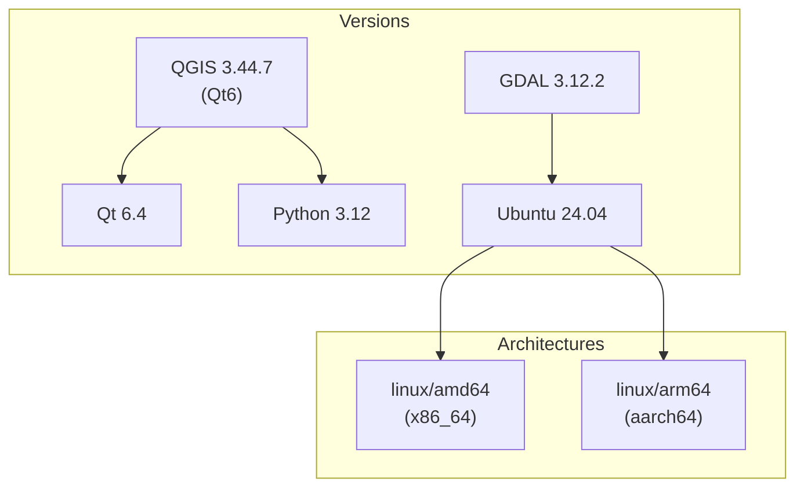
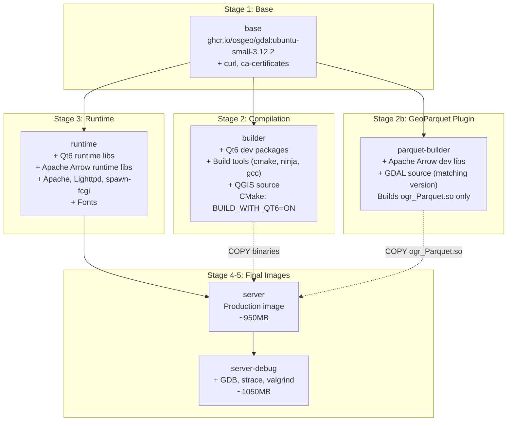
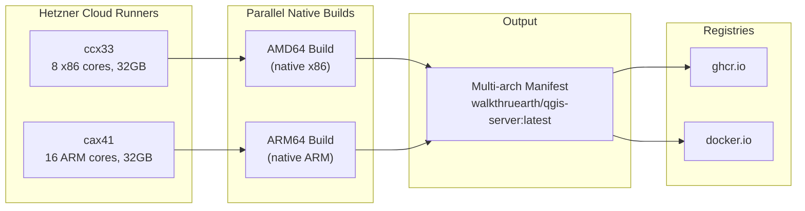
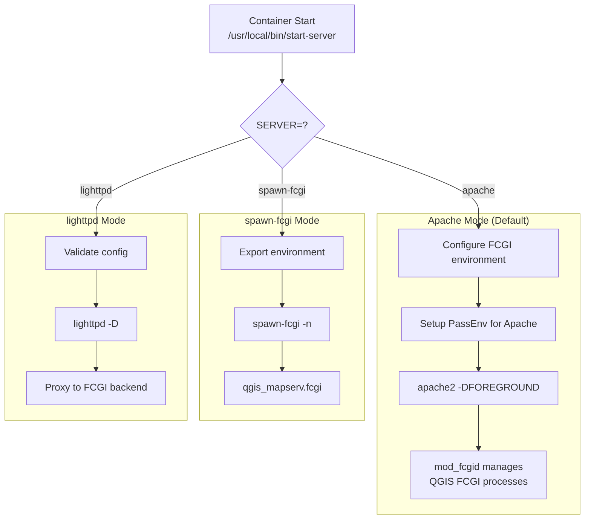
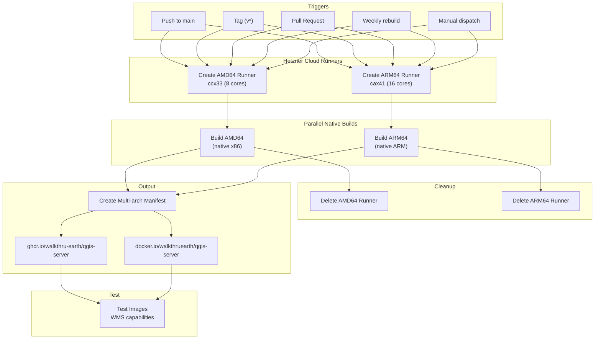
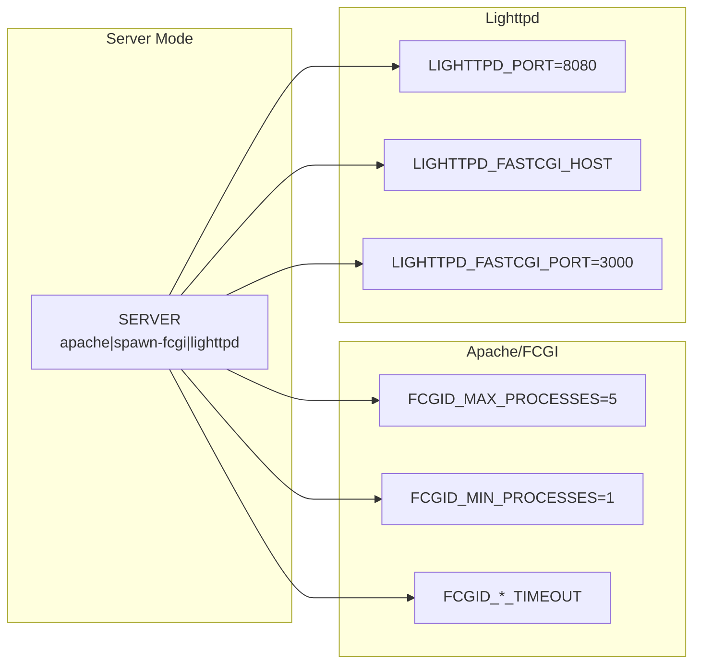
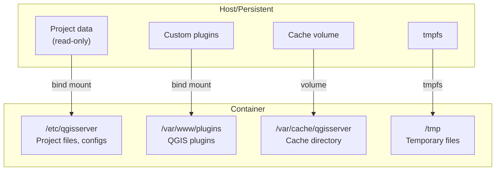

# QGIS Server Docker - Architecture Documentation

This document describes the architecture, build process, and deployment options for the QGIS Server Docker image.

## Table of Contents

- [Overview](#overview)
- [Technology Stack](#technology-stack)
- [Docker Build Architecture](#docker-build-architecture)
- [Multi-Architecture Support](#multi-architecture-support)
- [Server Modes](#server-modes)
- [CI/CD Pipeline](#cicd-pipeline)
- [Configuration Reference](#configuration-reference)

---

## Overview

This project provides a modern, multi-architecture Docker image for QGIS Server built with Qt6.

### Design Principles

1. **Multi-Architecture First**: Native support for AMD64 and ARM64
2. **Qt6 Native**: Built for QGIS 4.x with Qt6 (no Qt5 legacy)
3. **Minimal Runtime**: Small production image with only runtime dependencies
4. **Flexible Deployment**: Multiple server modes for different use cases
5. **Cloud Native**: Healthchecks, non-root user, read-only filesystem support

### Published Images

| Registry | Image |
|----------|-------|
| GitHub Container Registry | `ghcr.io/walkthru-earth/qgis-server` |
| Docker Hub | `docker.io/walkthruearth/qgis-server` |

---

## Technology Stack



| Component | Version | Notes |
|-----------|---------|-------|
| QGIS | 3.44.7 | Built from source with Qt6 |
| Qt | 6.4.2 | Ubuntu Noble default (patched, see below) |
| Python | 3.12 | With PyQt6 bindings |
| GDAL | 3.12.2 | Multi-arch base image |
| Ubuntu | 24.04 (Noble) | From GDAL base |

### Qt 6.4 Compatibility Patches

Ubuntu Noble ships Qt 6.4.2, but QGIS code assumes Qt 6.6+. The Dockerfile applies two patches at build time:

1. **`qmetatype.h` static_assert removal** — Qt 6.4 enforces `sizeof(T)` on pointer types in `Q_PROPERTY` / `Q_DECLARE_METATYPE`, failing when the type is only forward-declared (e.g., `QList<QgsMapLayer*>`). Qt 6.6+ relaxed this assertion. We patch the system Qt header to match Qt 6.6+ behavior, fixing all affected QGIS headers at once.

2. **`boundValueNames()` replacement** — `QSqlQuery::boundValueNames()` was added in Qt 6.6. QGIS uses it in `qgsauthconfigurationstoragedb.cpp` for debug logging only. We replace it with `QStringList()`.

### Why Not Upgrade Qt?

We investigated upgrading Qt on Ubuntu Noble. None of the available options are viable:

| Source | Qt Version | Status |
|--------|-----------|--------|
| Ubuntu 24.04 (Noble) stock | 6.4.2 | Current — needs patches |
| `ppa:lopin/qt6-backports` | 6.8.3 | Only 12 of ~40 Qt packages; missing serialport, positioning, svg, 5compat. Mixing 6.4 + 6.8 modules breaks at link time |
| `ppa:lengau/qt6-backports` | 6.9.2 | Only `qt6-base` — unusable alone |
| KDE Neon repos | 6.9.2 | Full stack but designed for KDE desktop, high risk of conflicts |
| Qt online installer / aqtinstall | Any | Installs to non-standard paths, adds ~500MB + complexity |
| Build Qt from source | Any | Adds 1-2 hours per build |

**QGIS upstream doesn't use PPAs either** — they simply build on Ubuntu 25.10 (Questing) which ships Qt 6.9.2 from stock repos.

The two patches we apply are minimal, well-understood, and forward-compatible (they replicate behavior already present in Qt 6.6+). See [Future Work](#future-work) for the plan to drop them.

### GeoParquet Support (GDAL Plugin)

The `ubuntu-small` GDAL base image intentionally excludes GeoParquet/Apache Arrow support to keep its size small (~385MB vs ~1.5GB for `ubuntu-full`). We add GeoParquet by building GDAL's Parquet driver as a **standalone plugin** (`ogr_Parquet.so`) in a separate build stage.

**How it works:**

1. A dedicated `parquet-builder` stage installs Apache Arrow dev libs from the [official Arrow apt repository](https://apache.jfrog.io/artifactory/arrow/ubuntu/) and clones the exact GDAL source matching the base image version
2. Only the Parquet driver is compiled as a standalone plugin using GDAL's plugin build system
3. The resulting `ogr_Parquet.so` (~1MB) is copied into the GDAL plugins directory
4. Apache Arrow runtime libraries (~150MB) are installed in the runtime stage

**Critical version constraint:** The GDAL source version used to build the plugin **must exactly match** the `libgdal` version in the base image. A mismatch causes `undefined symbol` errors at runtime (see [GDAL issue #13384](https://github.com/OSGeo/gdal/issues/13384)).

| Component | Version | Notes |
|-----------|---------|-------|
| Apache Arrow | 23.0.1 | From official Apache apt repo for Ubuntu Noble |
| GDAL plugin | Matches base image | Built from `v${GDAL_VERSION}` tag |
| Runtime libs | `libarrow2300`, `libparquet2300`, `libarrow-dataset2300`, `libarrow-compute2300` | ~150MB added |

**Result:** Full GeoParquet read/write support (`Parquet -vector- (rw+uv)`) with only ~150MB added to the final image instead of ~1.1GB from switching to `ubuntu-full`.

---

## Docker Build Architecture

### Multi-Stage Build

The Dockerfile uses a 6-stage build optimized for caching and minimal image size.



### Build Stages

| Stage | Purpose | Size Impact |
|-------|---------|-------------|
| `base` | GDAL + Python base | ~500MB |
| `builder` | Compile QGIS with Qt6 | ~4GB (not in final) |
| `parquet-builder` | Build GeoParquet GDAL plugin | ~2GB (not in final) |
| `runtime` | Runtime dependencies + Arrow libs | ~850MB |
| `server` | Final production image | ~950MB |
| `server-debug` | With debugging tools | ~1050MB |

> **Note:** Stages `builder` and `parquet-builder` run in parallel during Docker builds. Only the compiled binaries (~1MB plugin `.so`) are copied to the final image.

### CMake Configuration

```cmake
cmake .. \
    -GNinja \
    -DCMAKE_BUILD_TYPE=Release \
    -DCMAKE_INSTALL_PREFIX=/usr/local \
    -DCMAKE_C_FLAGS="-O2" \
    -DCMAKE_CXX_FLAGS="-O2" \
    -DBUILD_WITH_QT6=ON \           # Enable Qt6
    -DWITH_QTWEBKIT=OFF \           # Not available in Qt6
    -DWITH_SERVER=ON \
    -DWITH_SERVER_LANDINGPAGE_WEBAPP=OFF \
    -DWITH_DESKTOP=OFF \            # Server only
    -DWITH_GUI=OFF \
    -DWITH_3D=OFF \
    -DWITH_PDAL=OFF \
    -DWITH_BINDINGS=OFF \           # No Python bindings
    -DBUILD_TESTING=OFF \
    -DENABLE_TESTS=OFF
```

---

## Multi-Architecture Support

### How It Works

Both architectures are built natively on Hetzner Cloud self-hosted runners for maximum performance.



### Architecture Detection

The Dockerfile uses `TARGETARCH` to handle architecture-specific configurations:

```dockerfile
ARG TARGETARCH
# TARGETARCH = "amd64" or "arm64"

# Architecture-aware library paths
RUN ARCH_DIR=$(dpkg --print-architecture) && \
    ldconfig /usr/lib/${ARCH_DIR}-linux-gnu/
```

### Base Image Verification

The GDAL base image provides verified multi-arch support:

```bash
$ docker manifest inspect ghcr.io/osgeo/gdal:ubuntu-small-3.12.2
# Returns: linux/amd64, linux/arm64
```

---

## Server Modes

The container supports three server modes, selected via the `SERVER` environment variable.



### Mode Comparison

| Feature | Apache | spawn-fcgi | lighttpd |
|---------|--------|------------|----------|
| **Use Case** | Standard deployment | Kubernetes sidecar | Lightweight proxy |
| **Process Management** | mod_fcgid | Single process | External backend |
| **Memory** | Higher | Lowest | Low |
| **Complexity** | All-in-one | Requires pairing | Requires backend |
| **Port** | 8080 | 3000 | 8080 |

### Deployment Patterns

#### Pattern 1: Standalone (Apache)

```yaml
services:
  qgis:
    image: ghcr.io/walkthru-earth/qgis-server:latest
    ports:
      - "8080:8080"
    environment:
      QGIS_PROJECT_FILE: /data/project.qgs
    volumes:
      - ./data:/data:ro
```

#### Pattern 2: Kubernetes-Ready (spawn-fcgi + lighttpd)

```yaml
services:
  # FCGI backend (scalable)
  fcgi:
    image: ghcr.io/walkthru-earth/qgis-server:latest
    environment:
      SERVER: spawn-fcgi
    user: "1000:1000"
    read_only: true

  # Web frontend
  web:
    image: ghcr.io/walkthru-earth/qgis-server:latest
    environment:
      SERVER: lighttpd
      LIGHTTPD_FASTCGI_HOST: fcgi
    ports:
      - "8080:8080"
```

---

## CI/CD Pipeline

### Workflow Overview

The CI/CD pipeline uses Hetzner Cloud ephemeral self-hosted runners for cost-effective, fast builds.



### Hetzner Cloud Runner Costs

| Runner | Server Type | Specs | Cost/Hour |
|--------|-------------|-------|-----------|
| AMD64 | ccx33 | 8 dedicated x86 cores, 32GB RAM | ~$0.017 |
| ARM64 | cax41 | 16 ARM cores (Ampere), 32GB RAM | ~$0.044 |

Servers are automatically created before builds and deleted after completion (even on failure).

### Tag Strategy

| Trigger | Tags Generated |
|---------|----------------|
| Push to `main`/`master` | `latest` (multi-arch manifest) |
| Tag `v1.2.3` | `v1.2.3` (multi-arch manifest) |
| PR | Build only (not pushed) |

Per-architecture images are pushed by digest (no intermediate tags), then merged into a single multi-arch manifest using `docker buildx imagetools create`. This preserves provenance and SBOM attestations.

### Caching

The pipeline uses registry-based cache for Docker layers (no size limit, unlike GHA's 10 GB cap):

```yaml
cache-from: type=registry,ref=ghcr.io/walkthru-earth/qgis-server:cache-amd64
cache-to: type=registry,ref=ghcr.io/walkthru-earth/qgis-server:cache-amd64,mode=max
```

Separate cache refs per architecture prevent cache pollution.

### Required Secrets

| Secret | Description |
|--------|-------------|
| `PERSONAL_ACCESS_TOKEN` | GitHub PAT with "Administration" read/write access |
| `HCLOUD_TOKEN` | Hetzner Cloud API token with read/write permissions |
| `DOCKERHUB_TOKEN` | Docker Hub access token (optional) |

Set secrets via: GitHub → Repository → Settings → Secrets and variables → Actions

---

## Configuration Reference

### Environment Variables

#### Server Configuration



#### QGIS Server

| Variable | Description |
|----------|-------------|
| `QGIS_PROJECT_FILE` | Path to .qgs/.qgz project |
| `QGIS_SERVER_LOG_LEVEL` | 0=debug, 1=info, 2=warning, 3=critical |
| `QGIS_SERVER_LOG_STDERR` | Log to stderr (default: 1) |
| `QGIS_PLUGINPATH` | Plugin directory |
| `QGIS_AUTH_DB_DIR_PATH` | Auth database location |
| `PGSERVICEFILE` | PostgreSQL service file |

### Volumes



### Ports

| Port | Service | Mode |
|------|---------|------|
| 8080 | HTTP | Apache, Lighttpd |
| 3000 | FCGI | spawn-fcgi |

---

## File Structure

```
qgis-server/
├── .github/
│   └── workflows/
│       └── build.yaml           # CI/CD pipeline
├── runtime/
│   ├── etc/
│   │   ├── apache2/conf-enabled/
│   │   │   └── qgis.conf        # Apache FCGI config
│   │   └── lighttpd/
│   │       └── lighttpd.conf    # Lighttpd config
│   └── usr/local/bin/
│       ├── start-server         # Entry point
│       └── qgis-mapserv-wrapper # FCGI wrapper
├── tests/
│   └── data/                    # Test project files
├── Dockerfile                   # Multi-stage build
├── Makefile                     # Build commands
├── docker-compose.yaml          # Development
├── docker-compose.test.yaml     # Testing
└── README.md
```

---

## Performance Considerations

### Build Time (Hetzner Cloud Native Runners)

| Architecture | Server | Build Time |
|--------------|--------|------------|
| AMD64 | ccx33 (8 cores) | ~30-45 min |
| ARM64 | cax41 (16 cores) | ~45-60 min |

Both builds run in parallel, so total pipeline time equals the slower build.

### Optimization Tips

1. **Native ARM builds**: No QEMU emulation - uses Hetzner Ampere Altra servers
2. **Use ccache**: Mounted as BuildKit cache for incremental builds
3. **Parallel ninja**: Uses all available cores (`ninja -j$(nproc)`)
4. **Registry cache**: Preserves Docker layers between CI runs (no size limit)
5. **Ephemeral runners**: Fresh environment each build, no state pollution

### Resource Requirements

| Stage | RAM | Disk |
|-------|-----|------|
| Build (peak) | 8GB+ | 20GB |
| Runtime | 512MB+ | 1GB |

### Cost Comparison

| Provider | AMD64/hr | ARM64/hr | Savings |
|----------|----------|----------|---------|
| GitHub Actions | $1.32 | $0.84 | - |
| Hetzner Cloud | $0.017 | $0.044 | ~98% |

---

## Security

### Non-Root Execution

```yaml
services:
  qgis:
    image: ghcr.io/walkthru-earth/qgis-server:latest
    user: "1000:1000"  # Non-root
    read_only: true     # Immutable filesystem
    volumes:
      - data:/data:ro   # Read-only data
      - /tmp            # Writable tmpfs
```

### Healthcheck

Built-in health check for orchestration:

```dockerfile
HEALTHCHECK --interval=30s --timeout=10s --start-period=5s --retries=3 \
    CMD curl -f http://localhost:8080/ows?SERVICE=WMS&REQUEST=GetCapabilities || exit 1
```

---

## Future Work

### Drop Qt 6.4 patches when GDAL base image moves to Ubuntu 25.04+

The Qt 6.4 compatibility patches (see [Qt 6.4 Compatibility Patches](#qt-64-compatibility-patches)) exist only because the GDAL multi-arch base image (`ghcr.io/osgeo/gdal:ubuntu-small-*`) is built on Ubuntu 24.04 Noble, which ships Qt 6.4.2.

When the GDAL project releases a base image on **Ubuntu 25.04 (Plucky)** or later, we can:

1. Update the `GDAL_VERSION` / base image to the newer Ubuntu variant
2. Remove both Qt patches from the Dockerfile (the `qmetatype.h` patch and the `boundValueNames()` patch)
3. Benefit from stock Qt 6.8+ which has native support for all the features QGIS requires

| Ubuntu Version | Qt Version | Patches Needed | GDAL Base Available |
|---------------|-----------|---------------|-------------------|
| 24.04 Noble | 6.4.2 | Yes (2 patches) | Yes (current) |
| 25.04 Plucky | 6.8.3 | No | Not yet |
| 25.10 Questing | 6.9.2 | No | Not yet |

**Track this:** Watch the [GDAL Docker releases](https://github.com/OSGeo/gdal/tree/master/docker) for Ubuntu 25.04+ multi-arch images. Once available, the migration is straightforward — change the base image and delete the patch `RUN` block.
